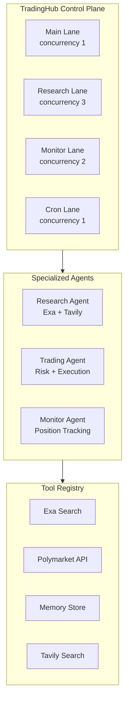

# Port Monopoly Agent to OpenClaw-Inspired Architecture

## Current Architecture

The project uses:

- **LangChain + Anthropic** via `[executor.py](agents/agents/application/executor.py)` - direct LLM calls with `ChatAnthropic`
- **Tavily** for web search (already integrated)
- **Linear execution flow**: Events → Filter → Markets → Filter → Forecast → Trade
- **FastAPI server** with WebSocket support
- **Database persistence** for forecasts and trades
- **AgentRunner** for scheduling

## Target Architecture




## Implementation Strategy

**Principle**: Minimal disruption. Introduce new architecture incrementally while keeping existing functionality operational.

---

## Phase 1: Add Dependencies & Tool Registry Foundation

**Goal**: Install Exa and Claude SDK, create tool registry without changing existing flow.

### Files to Create

1. `**[agents/core/__init__.py](agents/core/__init__.py)**` - New core module
2. `**[agents/core/tools.py](agents/core/tools.py)**` - Tool registry with Exa, Tavily, Polymarket tools

```python
# agents/core/tools.py - Core structure
from typing import Dict, Callable, Any
from exa_py import Exa
import os

class ToolRegistry:
    """Centralized tool definitions using Claude SDK format"""
    
    def __init__(self):
        self.exa = Exa(api_key=os.getenv("EXA_API_KEY"))
        self.tools: Dict[str, Dict] = {}
        self.executors: Dict[str, Callable] = {}
        self._register_default_tools()
        
    def _register_default_tools(self):
        """Register Exa, Tavily, Polymarket tools"""
        # Tool schemas follow Claude SDK format
        pass
```

### Files to Modify

1. `**[agents/pyproject.toml](agents/pyproject.toml)**` - Add dependencies:
  - `exa-py>=1.5.0`
  - `anthropic>=0.40.0` (direct Claude SDK)
2. `**[agents/.env](agents/.env)**` - Add:
  ```bash
   EXA_API_KEY=""
  ```

### Testing

- Import `ToolRegistry` in Python shell
- Verify Exa client initializes
- Verify tool schemas are valid

---

## Phase 2: Implement TradingHub (Control Plane)

**Goal**: Create lane-based task queue manager without disrupting existing executor.

### Files to Create

1. `**[agents/core/hub.py](agents/core/hub.py)**` - TradingHub with lane-based queuing

```python
# agents/core/hub.py - Core structure
from enum import Enum
from dataclasses import dataclass
from collections import deque
from anthropic import Anthropic

class Lane(Enum):
    MAIN = "main"       # Trading decisions (concurrency: 1)
    RESEARCH = "research"  # Background research (concurrency: 3)
    MONITOR = "monitor"    # Position monitoring (concurrency: 2)
    CRON = "cron"          # Scheduled tasks (concurrency: 1)

class TradingHub:
    """Single control plane managing all agent sessions"""
    
    def __init__(self):
        self.client = Anthropic()
        self.sessions: Dict[str, Session] = {}
        self.lanes: Dict[Lane, deque] = {...}
        self.lane_limits = {...}
        self.tool_registry = ToolRegistry()
        
    async def enqueue(self, task: Task):
        """Add task to appropriate lane"""
        pass
        
    async def _execute_task(self, task: Task, lane: Lane):
        """Execute task with Claude SDK tool use loop"""
        pass
```

1. `**[agents/core/session.py](agents/core/session.py)**` - Session state management

```python
@dataclass
class Session:
    id: str
    agent_type: str
    messages: List[Dict]
    state: Dict
    created_at: float
    
@dataclass
class Task:
    id: str
    lane: Lane
    prompt: str
    tools: List[str]
    context: Dict
    priority: int = 0
```

### Files to Modify

None yet - this is additive.

### Testing

- Create TradingHub instance
- Enqueue test tasks in different lanes
- Verify lane concurrency limits work
- Verify task execution with mock Claude responses

---

## Phase 3: Create Specialized Agents

**Goal**: Build ResearchAgent and TradingAgent that use TradingHub.

### Files to Create

1. `**[agents/core/agents/__init__.py](agents/core/agents/__init__.py)**`
2. `**[agents/core/agents/research_agent.py](agents/core/agents/research_agent.py)**` - Uses Exa + Tavily

```python
class ResearchAgent:
    """Specialized agent for market research"""
    
    def __init__(self, hub: TradingHub):
        self.hub = hub
        self.system_prompt = """You are a research analyst..."""
    
    async def research_market(self, market_question: str, 
                             market_description: str) -> Dict:
        """Deep research using exa_research tool"""
        task = Task(
            id=f"research_{hash(market_question)}",
            lane=Lane.RESEARCH,
            prompt=f"""Research this market: {market_question}
            Use exa_research to find recent news...""",
            tools=["exa_research", "tavily_search", "store_insight"],
            context={"market_question": market_question}
        )
        return await self.hub.enqueue(task)
```

1. `**[agents/core/agents/trading_agent.py](agents/core/agents/trading_agent.py)**` - Trade evaluation

```python
class TradingAgent:
    """Specialized agent for trade execution"""
    
    def __init__(self, hub: TradingHub):
        self.hub = hub
        self.system_prompt = """You are a quantitative trading agent..."""
    
    async def evaluate_trade(self, market_id: str, 
                            research: Dict) -> Dict:
        """Evaluate trade using get_market_data tool"""
        task = Task(
            id=f"trade_{market_id}",
            lane=Lane.MAIN,  # Trading serialized
            prompt=f"""Evaluate trade for market {market_id}...""",
            tools=["get_market_data", "calculate_edge"],
            context={"market_id": market_id}
        )
        return await self.hub.enqueue(task)
```

### Files to Modify

None yet - keeping existing flow intact.

### Testing

- Create agents with mock hub
- Test research_market generates correct task
- Test evaluate_trade generates correct task
- Verify system prompts are appropriate

---

## Phase 4: Migrate Executor to Use Claude SDK

**Goal**: Replace LangChain calls with direct Claude SDK in existing Executor.

### Files to Modify

1. `**[agents/agents/application/executor.py](agents/agents/application/executor.py)**`

**Changes**:

- Replace `from langchain_anthropic import ChatAnthropic` with `from anthropic import Anthropic`
- Replace `self.llm = ChatAnthropic(...)` with `self.client = Anthropic()`
- Update `get_superforecast()` to use `client.messages.create()`
- Update `source_best_trade()` to use tool use pattern
- Keep existing dry_run logic
- **Preserve all existing method signatures** so `[trade.py](agents/agents/application/trade.py)` doesn't break

**Example migration**:

```python
# OLD (LangChain)
def get_superforecast(self, event_title: str, market_question: str, outcome: str) -> str:
    messages = self.prompter.superforecaster(...)
    result = self.llm.invoke(messages)
    return result.content

# NEW (Claude SDK)
def get_superforecast(self, event_title: str, market_question: str, outcome: str) -> str:
    messages = self.prompter.superforecaster(...)
    response = self.client.messages.create(
        model="claude-sonnet-4-20250514",
        max_tokens=4096,
        messages=[{"role": "user", "content": messages}]
    )
    return response.content[0].text
```

### Files to Modify

1. `**[agents/pyproject.toml](agents/pyproject.toml)**` - Keep `langchain-anthropic` for now (gradual migration)

### Testing

- Run existing tests in `[tests/integration/test_executor.py](agents/tests/integration/test_executor.py)`
- Verify `[trade.py](agents/agents/application/trade.py)` still works
- Test dry_run mode still generates mock responses
- Compare output quality with old LangChain version

---

## Phase 5: Add Approval Workflow

**Goal**: Implement human-in-the-loop for high-risk trades.

### Files to Create

1. `**[agents/core/approvals.py](agents/core/approvals.py)**` - Approval manager

```python
class ApprovalManager:
    """Human-in-the-loop for high-risk operations"""
    
    async def request_approval(self, trade_id: str, 
                              trade_data: Dict,
                              timeout: int = 300) -> bool:
        """Request approval (blocks until approved/rejected)"""
        # Auto-approve if below risk threshold
        if trade_data.get("size", 0) < 0.05:
            return True
        
        # Store pending, emit WebSocket event
        self.pending[trade_id] = trade_data
        await self._notify_dashboard(trade_id, trade_data)
        
        # Wait for approval with timeout
        return await self._wait_for_approval(trade_id, timeout)
```

### Files to Modify

1. `**[agents/agents/application/trade.py](agents/agents/application/trade.py)**`

Add approval check before execution:

```python
# After calculating trade
if not self.dry_run:
    # Request approval for large trades
    if amount > threshold:
        approved = await approval_mgr.request_approval(trade_id, trade_data)
        if not approved:
            print("[REJECTED] Trade rejected by operator")
            return
    
    # Execute trade
    trade = self.polymarket.execute_market_order(market, amount)
```

1. `**[agents/scripts/python/server.py](agents/scripts/python/server.py)**`

Add approval endpoints:

```python
@app.post("/api/approvals/{trade_id}/approve")
async def approve_trade(trade_id: str):
    approval_mgr.approve(trade_id)
    return {"status": "approved"}

@app.post("/api/approvals/{trade_id}/reject")
async def reject_trade(trade_id: str):
    approval_mgr.reject(trade_id)
    return {"status": "rejected"}
```

### Testing

- Test auto-approval for small trades
- Test pending approval flow
- Test timeout behavior
- Verify WebSocket notifications work

---

## Phase 6: Integrate New Architecture into Runner

**Goal**: Make `[runner.py](agents/agents/application/runner.py)` use TradingHub and specialized agents.

### Files to Modify

1. `**[agents/agents/application/runner.py](agents/agents/application/runner.py)**`

**Changes**:

- Add `from agents.core.hub import TradingHub`
- Add `from agents.core.agents import ResearchAgent, TradingAgent`
- Initialize hub and agents in `__init__`
- Update `run_agent_cycle()` to use new flow:

```python
async def run_agent_cycle(self) -> dict:
    # New flow with hub
    hub = TradingHub()
    research_agent = ResearchAgent(hub)
    trading_agent = TradingAgent(hub)
    
    # Get events (existing)
    events = self.trader.polymarket.get_all_tradeable_events()
    
    # Filter with RAG (existing)
    filtered_events = self.trader.agent.filter_events_with_rag(events)
    
    # Get markets (existing)
    markets = self.trader.agent.map_filtered_events_to_markets(filtered_events)
    
    # NEW: Research in parallel
    research_tasks = []
    for market in markets[:5]:  # Top 5 markets
        task = research_agent.research_market(
            market["question"],
            market["description"]
        )
        research_tasks.append(task)
    
    research_results = await asyncio.gather(*research_tasks)
    
    # NEW: Evaluate trades
    for i, market in enumerate(markets[:5]):
        trade_eval = await trading_agent.evaluate_trade(
            market["id"],
            research_results[i]
        )
        
        if trade_eval["recommendation"] != "PASS":
            # Execute via existing polymarket client
            pass
```

### Files to Modify

1. `**[agents/agents/application/trade.py](agents/agents/application/trade.py)**`

Add method to use new agents:

```python
def one_best_trade_v2(self) -> None:
    """New version using TradingHub and specialized agents"""
    # Implement new flow here
    pass
```

Keep `one_best_trade()` for backward compatibility.

### Testing

- Run full cycle with new architecture
- Verify research runs in parallel (check lane concurrency)
- Verify trades still execute correctly
- Compare performance with old architecture

---

## Phase 7: Add WebSocket Status Updates

**Goal**: Real-time lane status, pending approvals, session info.

### Files to Modify

1. `**[agents/scripts/python/server.py](agents/scripts/python/server.py)**`

Add status endpoint:

```python
@app.get("/api/hub/status")
async def get_hub_status():
    """Get TradingHub status"""
    hub = get_trading_hub()
    return {
        "sessions": len(hub.sessions),
        "lane_status": {
            lane.value: {
                "active": hub.active_tasks[lane],
                "queued": len(hub.lanes[lane])
            }
            for lane in Lane
        }
    }
```

Update WebSocket to broadcast hub status:

```python
@app.websocket("/ws")
async def websocket_endpoint(websocket: WebSocket):
    await websocket.accept()
    
    while True:
        state = {
            "agent_status": agent_runner.get_status(),
            "hub_status": hub.get_status(),
            "pending_approvals": approval_mgr.pending
        }
        await websocket.send_json(state)
        await asyncio.sleep(2)
```

### Testing

- Connect to WebSocket
- Verify hub status updates
- Verify approval notifications
- Test with dashboard UI

---

## Phase 8: Cleanup & Documentation

**Goal**: Remove deprecated code, update docs.

### Files to Modify

1. `**[agents/README.md](agents/README.md)**` - Update architecture diagram
2. `**[agents/agents/application/executor.py](agents/agents/application/executor.py)**` - Remove unused LangChain imports
3. `**[agents/pyproject.toml](agents/pyproject.toml)**` - Mark `langchain-anthropic` as optional

### Files to Create

1. `**[agents/ARCHITECTURE.md](agents/ARCHITECTURE.md)**` - Document new architecture

```markdown
# Architecture

## TradingHub Control Plane

- Lane-based concurrency (Main, Research, Monitor, Cron)
- Session management
- Tool registry

## Specialized Agents

- ResearchAgent: Exa + Tavily for deep market research
- TradingAgent: Risk calculation and execution
- MonitorAgent: Position tracking (future)

## Tool Registry

- exa_research: High-quality web search
- tavily_search: General web search
- get_market_data: Polymarket API
- store_insight: Memory persistence
```

### Testing

- Run full test suite
- Verify all CLI commands work
- Test dry_run and live modes
- Performance benchmarks

---

## Migration Checklist

- Phase 1: Dependencies & Tool Registry (2-3 hours)
- Phase 2: TradingHub Implementation (4-6 hours)
- Phase 3: Specialized Agents (3-4 hours)
- Phase 4: Migrate Executor to Claude SDK (4-6 hours)
- Phase 5: Approval Workflow (3-4 hours)
- Phase 6: Integrate into Runner (4-6 hours)
- Phase 7: WebSocket Status (2-3 hours)
- Phase 8: Cleanup & Documentation (2-3 hours)

**Total estimated time**: 24-35 hours over 1-2 weeks

---

## Rollback Strategy

Each phase is additive and non-breaking:

- New code lives in `agents/core/` (doesn't touch existing `agents/application/`)
- Existing `Executor` keeps working during migration
- Can run old and new flows side-by-side
- If issues arise, simply don't call new methods

## Key Benefits After Migration

1. **Parallel research** - Research 3 markets simultaneously vs sequential
2. **Better tool use** - Native Claude SDK tool calling vs LangChain wrapper
3. **Approval workflows** - Human oversight for high-risk trades
4. **Lane-based queuing** - Prevents research from blocking trades
5. **Session persistence** - Context maintained across multi-turn conversations
6. **Cleaner architecture** - Separation of concerns (hub, agents, tools)
7. **Exa integration** - Higher quality research vs Tavily alone

## Testing Strategy

Each phase includes:

1. Unit tests for new components
2. Integration tests with existing components
3. End-to-end test of full trading cycle
4. Performance comparison with old architecture

Run tests with:

```bash
uv run pytest tests/integration/
uv run pytest tests/e2e/
```

